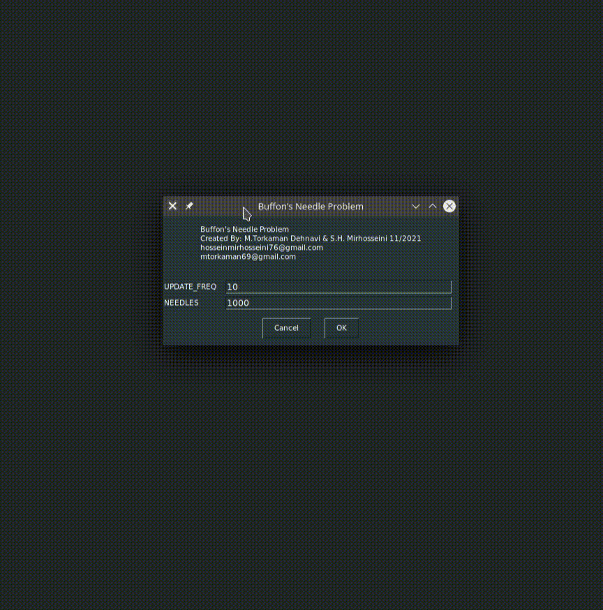

# Python3 GUI app Monte Carlo method for approximating Pi

## Clone project

```bash
git clone https://github.com/mohammaddehnavi/Monte-Carlo-Simulation.git
cd Monte-Carlo-Simulation
```
## Install virtual env 

```bash
pip3 install virtualenv
python3 -m venv env-Monte-Carlo-Simulation
source env-Monte-Carlo-Simulation/bin/activate
```

## Install requirements

```bash
## Upgrade your pip
pip install --upgrade pip

## install packages
pip install -r requirements.txt
```

## RUN

```bash
python3 buffon-needle.py
```

## Application Gif


